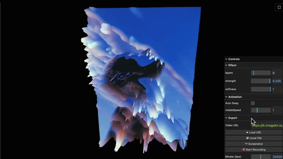

<div align="center">
  <a name="readme-top"></a>
  
  <h1 align="center">DISPLACEMENT VIEW</h1>
  <h3 align="center"> WebGL Dynamic Image & Video Displacement Shader Engine </h3>
</div>

<div align="center">
  <!-- TOP PURPLE LINKS -->
  <a href="https://beto.group"></a>
  <a href="https://discord.com/invite/6rDp4q4Y2B"></a>
  <a href="https://github.com/sponsors/beto-group"></a>
  <br/>
  <!-- BOTTOM GOLD TAXONOMY -->
  
  
  
  <hr>
</div>

<div align="center">
  
</div>

<div align="center">
  <p>
    <i> A Three.js WebGL image/video displacement mapping shader engine — visualizing elevation layers, interactive sway physics, and high-bitrate WebM video capture. </i>
  </p>
  <hr style="width:30%;">
</div>

Welcome to **Displacement View**, an interactive WebGL showcase that applies dynamic displacement shaders to any dropped image or video file. The custom GLSL elevation algorithm calculates brightness value offsets dynamically, raising mesh vertices in real-time. Features include manual parameter controls, auto-sway physics, export/record functions, and native Obsidian HSL theme variable bindings.

---

## Features

### WebGL Shader Math
*   **Real-time Displacement**: Elevates plane geometry vertices based on source luminance value layers.
*   **Adjustable Layers & Softness**: Fine-tune the stepping bands and brightness interpolation in real-time.
*   **Interactive Controls**: Sway speed, displacement strength, and auto-rotation sway toggling.

### Media Import & Export
*   **Drag and Drop Support**: Drop any local image or video directly onto the canvas.
*   **URL Video Stream**: Instantly fetch and map remote MP4 streams.
*   **WebM/MP4 Recording**: Export high-bitrate screen recording clips of your displacement animations.
*   **Screenshot Capture**: Instantly snap high-resolution PNG copies of the WebGL canvas.

### Native Vault Styling
*   **Obsidian Integration**: The `lil-gui` panel dynamically styles background HSL and active accent tokens from your host Obsidian theme.
*   **Portal View Leaf**: Reparents cleanly into pane workspaces for seamless edge-to-edge layouts.

---

## Directory Index & Components

| File | Description |
| :--- | :--- |
| **[`DISPLACEMENT VIEW.md`](DISPLACEMENT%20VIEW.md)** | The main entry point leaf designed to be loaded inside Obsidian panes. |
| **[`src/index.jsx`](src/index.jsx)** | Main bootstrap application loader and polling invalidation daemon. |
| **[`src/App.jsx`](src/App.jsx)** | The view coordinator loading dependency modules. |
| **[`src/components/DisplacementComponent.jsx`](src/components/DisplacementComponent.jsx)** | The core displacement shader, rendering loop, and MediaRecorder binding. |
| **[`src/styles/styles.jsx`](src/styles/styles.jsx)** | Layout variables mapped to Obsidian theme CSS properties. |
| **[`src/utils/domUtils.jsx`](src/utils/domUtils.jsx)** | DOM helper utilities for full-tab containment. |
| **[`src/utils/LoadScriptUpgrade.js`](src/utils/LoadScriptUpgrade.js)** | Self-contained ESM script loader with local vault cache support. |
| **[`data/mcp_commands.json`](data/mcp_commands.json)** | Local polling payload for HMR invalidation. |
| **[`METADATA.md`](METADATA.md)** | Packaging manifest outlining indexing, target, and security configurations. |
| **[`CONTRIBUTION.md`](CONTRIBUTION.md)** | Contributor architecture standards. |
| **[`LICENSE.md`](LICENSE.md)** | MIT open-source license. |

---

## 🚀 Quick Start & Installation

1. **Get the Code**:
   *   **Option A**: Clone directly into your Obsidian vault directory:
       ```shell
       git clone https://github.com/beto-group/DisplacementView
       ```
   *   **Option B**: Extract the repository ZIP into your Obsidian vault.
2. **Prerequisites**: Ensure the **Datacore** community plugin is active in Obsidian.
3. **Launch**: Open **`DISPLACEMENT VIEW.md`** inside Obsidian.

---

## 🌟 Attribution

The visual and mathematical core of the dynamic displacement shader, elevation processing, and WebGL rendering in this project was ported and adapted from a creative experiment originally published on [CodePen](https://codepen.io/).

---

## ⚖️ License

This project is licensed under the MIT License — see the [`LICENSE.md`](LICENSE.md) file for details.

<p align="right">(<a href="#readme-top">back to top</a>)</p>
